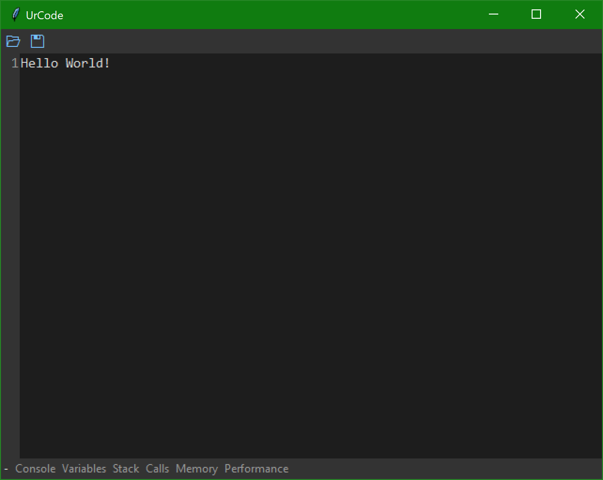
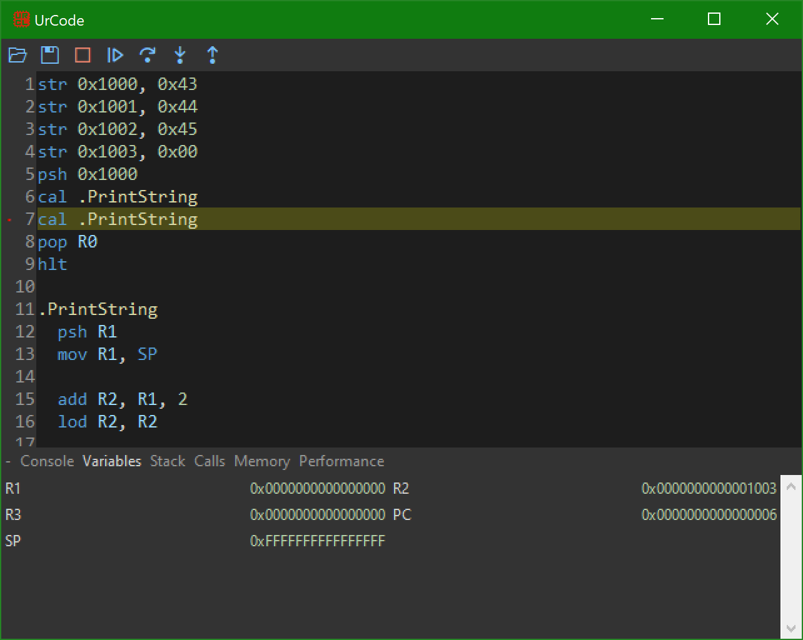

# UrCode
An open-source, cross-platform, general-purpose, totally-awesome IDE.

## Getting Started
### Requirements
UrCode requires **Python 3.8 or later**.
### Launching the Editor
There are many ways to launch the editor depending on your usage needs:
- Run `UrCode.pyw` with your system's file association set to Python.
- Run it via the command line with `python UrCode.pyw`.
- Import the module and call `run`.
```py
import UrCode
UrCode.run()
```

## Base Editor
The base editor allows for reading, writing, and modifying of text files.



## Plugin Support
With language and editor plugins, the editor becomes a full IDE with syntax highlighting, step-by-step debugging, breakpoints, runtime variable, stack, and memory viewing, and function-level performance hot paths.



## Plugin Development
Plugins come in two flavors: Editor and Language. Editor plugins are always loaded by the editor, while language plugins are only loaded when authoring a specific file type.

### Simple Plugin
A language plugin that highlights `hello` and `world` in files with the extension `.hw`.
```py
# ./plugins/hw/__init__.py
from editor.base import ui

ui.text_editor.add_object_type("keyword", r"[Hh][Ee][Ll]{2}[Oo]")
ui.text_editor.add_object_type("type", r"[Ww][Oo][Rr][Ll][Dd]")
```